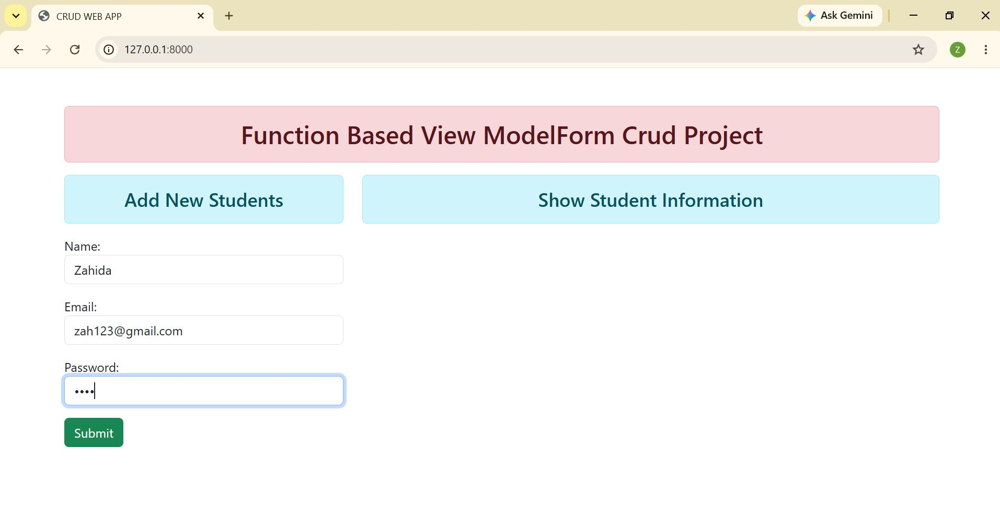
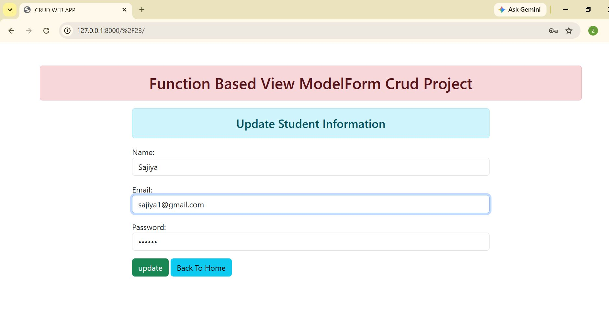
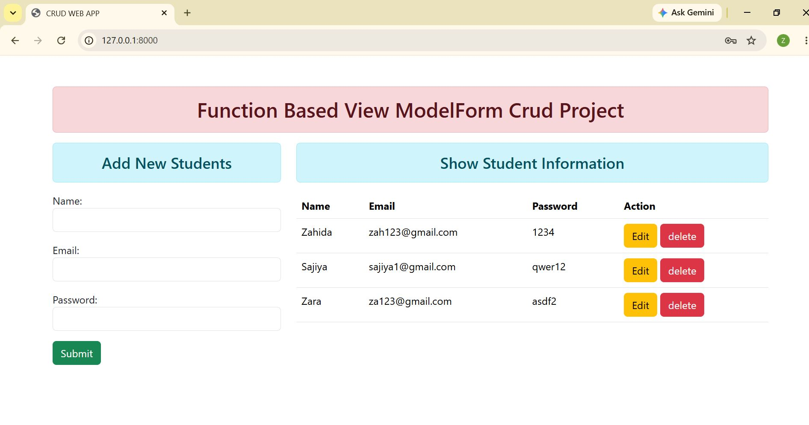

# Django CRUD App

A Django CRUD application developed using Python, Django, HTML, CSS, and SQLite. This project demonstrates the implementation of Create, Read, Update, and Delete (CRUD) operations through a simple and user-friendly web interface.

## Project Overview

The Django CRUD App allows users to manage records efficiently. Users can add new records, view existing records in a table, update record information, and delete records when required. The project uses Django for backend development, SQLite as the database, and HTML/CSS for the frontend interface.

## Features

- Create new records
- View all records in a structured table
- Update existing records
- Delete records
- SQLite database integration
- Simple and user-friendly interface

## Technologies Used

- Python
- Django
- SQLite
- HTML
- CSS

## Screenshots

### Home Page 1



### Home Page 2


### Update Page



### Home Page 3



## How to Run the Project

### 1. Clone the Repository

```bash
git clone https://github.com/zahidacodes/django-crud-app.git
```

### 2. Navigate to the Project Directory

```bash
cd django-crud-app
```

### 3. Install Django

```bash
pip install django
```

### 4. Run the Development Server

```bash
python manage.py runserver
```

### 5. Open the Application

Open your browser and visit:

```text
http://127.0.0.1:8000/
```

## Database

This repository includes the `db.sqlite3` database file with sample records for demonstration purposes.

## CRUD Operations

### Create
Add new records through the form.

### Read
View all stored records in a structured table.

### Update
Modify existing records using the update functionality.

### Delete
Remove records from the database using the delete option.

## Project Structure

```text
django-crud-app/
│
├── manage.py
├── db.sqlite3
├── formapi
├── templates/
├── static/
├── ProjectScreenshots/
├── app/
└── README.md
```

## Future Improvements

- Search functionality
- User authentication
- Responsive design
- Pagination
- Advanced filtering options

## Author

Zahida
